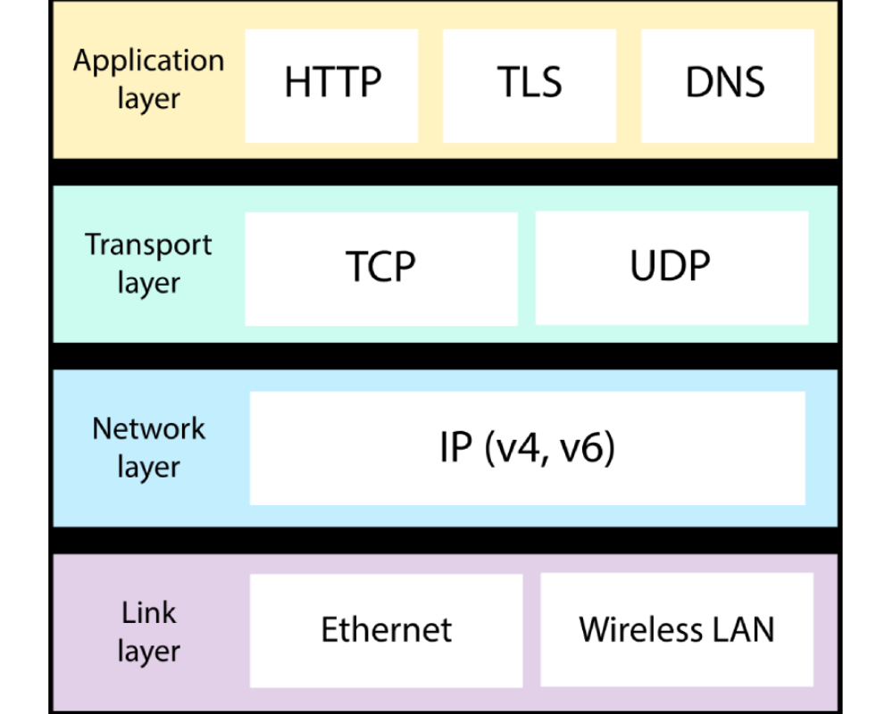

# What is Protocol Stack?
Before moving ahead with Internet Protocol Stack, let's know the meaning of **protocol**.
Protocol is a system of fixed rules and formal behaviour. Hence internet is also following some rules and protocols.

The Internet Protocol Suite, is a set of rules and protocols that enable devices to communicate on the internet. Each protocol operates at a different layer, building functionality on top of the layer below it.

the Internet Protocol Stack is like a multi-layered cake (mmm, cake) that enables communication between devices on a network.

## The layers of the Internet Protocol Stack are:

1. Physical Layer: This is where the actual physical connection happens, like plug in that Ethernet cable or connect via Wi-Fi to get things rolling.

2. Data Link Layer: Think of this layer as the bouncer at a club, ensuring data integrity and minimizing errors as it moves from one point to another.

3. Network Layer: Ah, the network layer, the traffic cop of the Internet. It handles the routing, forwarding, and addressing of data packets, making sure they reach their intended destination without getting lost in the digital abyss.

4. Transport Layer: Here's where things get interesting. The transport layer ensures reliable delivery of data packets, like a super chill delivery guy who never drops your pizza. It also manages the flow control, so your network doesn't get congested like a Monday morning subway.

5. Application Layer: Ta-da! The final layer, where all the magic happens. It's responsible for handling specific applications like email, web browsing, or streaming cat videos (the most important application, obviously).

## how is it used in web development?
In web development, when a user interacts with a website through a web browser, the following process occurs:

The user's web browser sends an HTTP request to the server. This request is encapsulated into packets at the Transport Layer and given appropriate addressing information at the Internet Layer, including the source and destination IP addresses.

The request packets traverse through various routers and switches on the internet, using the routing information provided by the Internet Layer.

The packets eventually reach the destination server. The server's network interface receives the packets and forwards them up the layers of the IP stack.

At the server's Application Layer, the HTTP server software processes the request, interacts with the web application, and generates an HTTP response.

The response is divided into packets at the Transport Layer and given proper addressing information at the Internet Layer.

The response packets travel back through the internet, following the path determined by the IP routing.

Finally, the response reaches the user's web browser, where it is reconstructed, and the web page is displayed to the user.

Throughout this process, the IP stack ensures that data is sent and received accurately and reliably, allowing web development to take place on a global scale over the internet.

