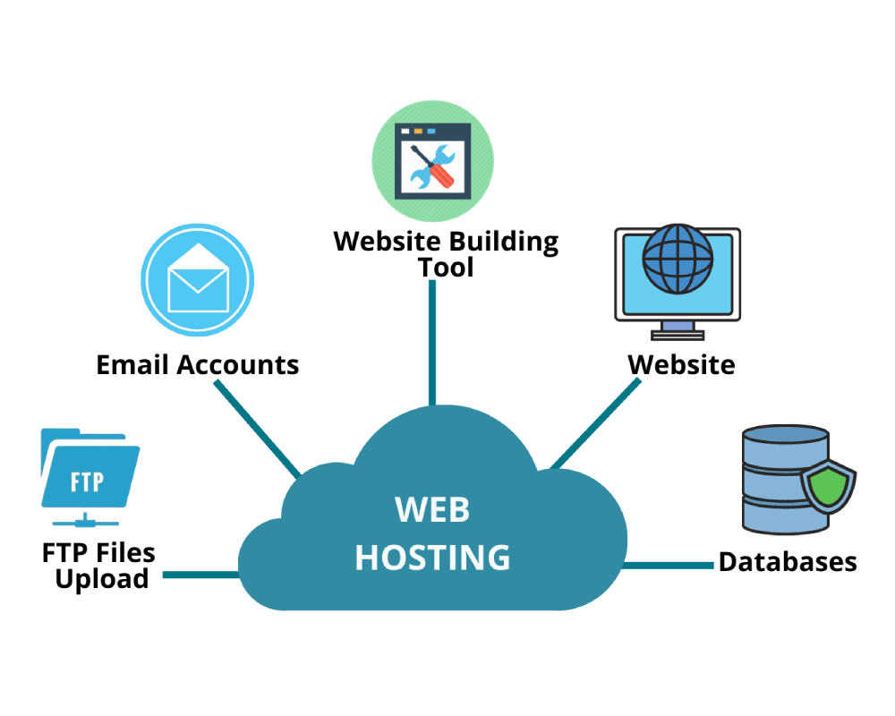

# What Is Web Hosting?

Web hosting, is the art of bringing websites to life on the internet. It's like finding the perfect home for your website, a place where it can thrive and connect with its virtual neighbors. But what exactly does it mean? Well, in simple terms, web hosting is a service that allows individuals or organizations to make their websites accessible via the World Wide Web.

Now, let's dive into the nitty-gritty and break it down further. Web hosting refers to the process of storing website files on a server, which is essentially a supercharged computer that operates 24/7. This server ensures that your website is always available to visitors, without any hiccups or downtime.

Think of it as renting out a space in a shopping mall. You get a portion of the mall, complete with all the necessary infrastructure to showcase your products or services. The web hosting provider takes care of the technical aspects, such as server maintenance, security, and ensuring your website runs smoothly.

 ## Different Types of Hosting Services

Web hosting is like giving your website a cozy little home on the internet. It's a service that allows individuals and businesses to make their websites accessible to the world. But wait, there's more! There are different types of hosting services available, each with its own unique features and benefits. So, let's dive right in, shall we?

`Shared Hosting:` First up, we have Shared Hosting. It's like living in a dorm room with other websites. You all share the same resources, which means shared hosting is an affordable option for those on a budget. However, just like living with roommates, you might experience some noisy neighbors or slow load times if another website on the server is hogging the resources.

`VPS Hosting:` Next, we have VPS Hosting. It's like having your own apartment in a high-rise building. You get more privacy and dedicated resources, making it ideal for websites with higher traffic and more complex needs. Plus, you have the flexibility to customize your space to suit your specific requirements. However, be prepared to pay a bit more for this luxurious living arrangement.

`Dedicated Hosting:` Now, let's talk about Dedicated Hosting. It's like owning a lavish mansion solely for your website. You have an entire server to yourself, which means you get lightning-fast performance and top-notch security. This type of hosting is perfect for large e-commerce sites or websites with heavy traffic. But beware, the price tag for this exclusive retreat can be quite hefty.

`Cloud Hosting:`  We have Cloud Hosting like booking a suite in a luxury hotel. Your website is hosted across multiple servers, providing unmatched reliability and scalability. It's perfect for websites that experience unpredictable traffic spikes or need to handle large amounts of data. Plus, you only pay for the resources you use, making it a cost-effective option.

`Reseller Hosting:` Reseller hosting is like being a middleman. You purchase hosting resources in bulk from a provider and sell smaller hosting plans to others.
Use Reseller Hosting When: You want to start your web hosting business or manage multiple websites for clients.

So, there you have it! Different hosting services to suit every website's needs and budget. From the affordable shared hosting to the luxurious dedicated hosting and the flexible VPS and cloud hosting options, there's something for everyone. The key is to choose the hosting service that aligns perfectly with your website's requirements and ensure your online presence feels right at home.

