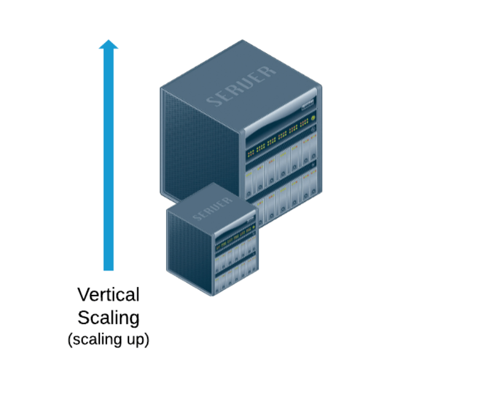
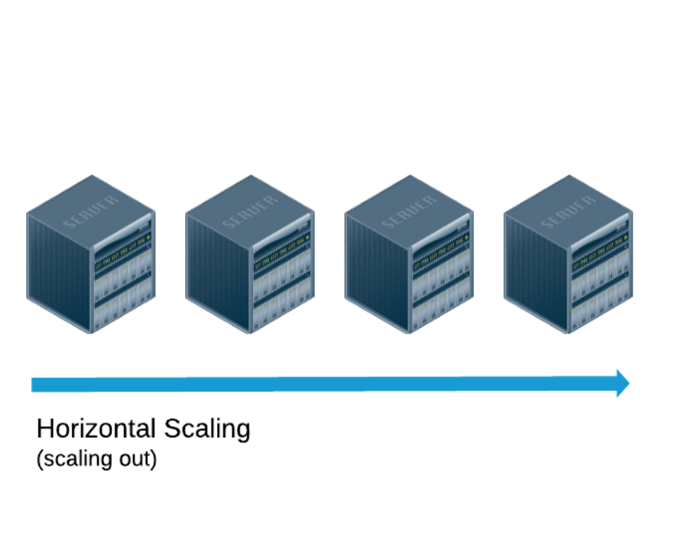

# What is scaling, and why is it important for web applications?

Scaling is the art of making sure your web application can handle increased traffic and usage without crashing and burning like a sad little coding flame. It's like preparing for a rock concert where your application is the main attraction and you don't want it to break down and embarrass you in front of your screaming fans. By understanding the concept and implementing best practices like load testing, caching strategies, and database optimization, you can take your web application to new heights.

## Best Practices for Scaling

1. *`Load testing:`* Because who wouldn't want to push their app to its limits? Test how it performs under heavy traffic to identify bottlenecks and improve performance.  
2. *`Caching strategies:`* Don't make your users wait for the same data over and over again. Implement caching mechanisms to store commonly accessed information and serve it up lightning fast.  
3. *`Database optimization:`* Let's trim the digital fat! Optimize your database for efficiency by indexing, denormalizing, and cleaning up queries. Keep things running smoothly behind the scenes.

## How does scaling differ for vertical and horizontal scaling?

**`Vertical scaling:`** involves increasing the resources of a single server, like adding more RAM or upgrading the processor. This method ensures that your server can handle increased load efficiently. It's like giving your server a big boost of power and capability. The advantages of vertical scaling include improved performance and enhanced capacity. So, if you want to make your server feel like the 'Hulk', vertical scaling is the way to go!

**`Horizontal Scaling:`** On the other hand, we have horizontal scaling, which is like assembling a team of superheroes to tackle a problem together. 

With horizontal scaling, you add more machines to distribute the load. It's like forming an Avengers-like squad where each member brings their unique skills to the table. Horizontal scaling offers flexibility, fault tolerance, and endless possibilities. And let's not forget the joy of seeing your infrastructure grow and expand like a universe of its own.
